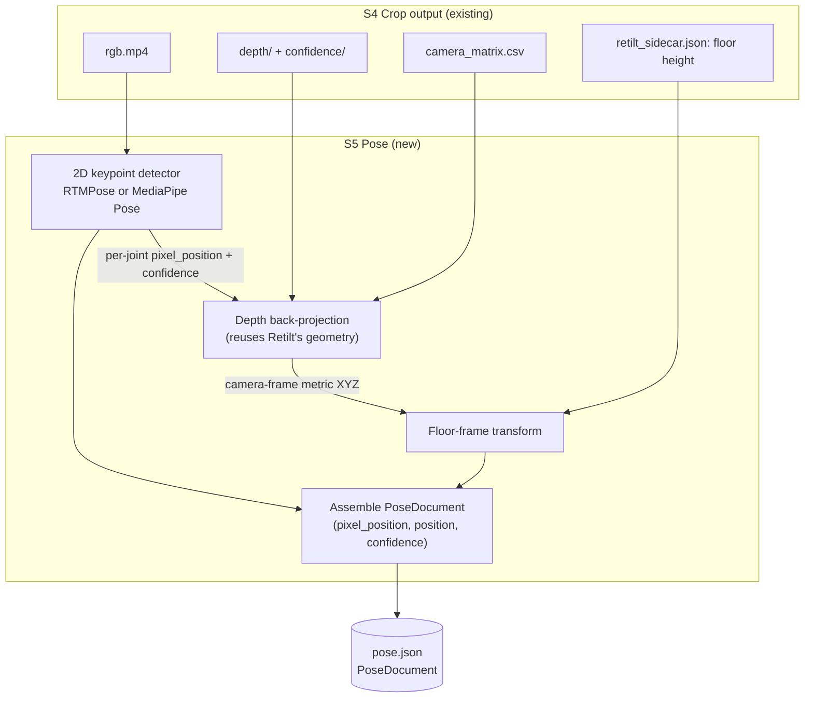

# S5 Pose — Joint Detection Model Recommendation

Status: **draft** | Scope: GitHub issue [#118](https://github.com/tony-yehui-lou/PowerFlow/issues/118) "Find a Suitable Model", under epic [#61](https://github.com/tony-yehui-lou/PowerFlow/issues/61) "Joint Detection" | Updated: 2026-09-17

## Executive Summary

S5 Pose needs to turn one camera's cropped RGB video into per-joint pixel coordinates, per-joint
confidence, and per-joint **metric 3D position in a floor-anchored frame** (`PoseDocument`,
`common/models.py`). The recommended architecture splits this into two independently-chosen
pieces: **any permissively-licensed 2D keypoint detector on RGB** (MediaPipe Pose or RTMPose),
followed by **depth-based back-projection reusing S3 Retilt's own geometry** — not a monocular
metric-3D model — because S4 Crop's output directory already carries LiDAR `depth/`,
`confidence/`, and `camera_matrix.csv` alongside `rgb.mp4`, and no monocular model can beat real
depth for absolute scale. The single biggest risk: this requires extending `PoseModel.predict`'s
signature beyond `rgb_path` alone, since depth and intrinsics aren't currently passed to the
model — a small, contained interface change, not a new pipeline stage.

## Requirements → Capabilities

| Capability | Priority | Description | Constraints |
|---|---|---|---|
| 2D keypoint detection | Must-have | Locate the 15 `JointId` joints in pixel space per RGB frame | Single person, static camera, offline batch (Prefect worker, no real-time bound), Python/torch-friendly, permissive license required (closed-source commercial product) |
| Metric 3D lifting (floor-frame) | Must-have | Turn per-joint pixels into real-world metres in `PoseDocument`'s floor-anchored frame | Depth + camera intrinsics already sit in S4's output directory (same inputs S3 Retilt used) but aren't yet exposed to `PoseModel`; the fork is depth back-projection (extend the interface, reuse Retilt's geometry) vs. a monocular absolute-scale model (keep the interface RGB-only) |

## Recommended Components

### 2D keypoint detection

- **Choice:** [RTMPose](https://github.com/open-mmlab/mmpose/tree/main/projects/rtmpose) (via MMPose), with [MediaPipe Pose](https://developers.google.com/edge/mediapipe/solutions/vision/pose_landmarker) as the lower-integration-cost fallback if `mmpose`/`mmcv`'s dependency footprint is unwelcome.
- **Why:** Apache-2.0 licensed end to end (code and released weights), no commercial-use restriction, and it reports 75.8% AP on COCO at 90+ FPS on a CPU / 430+ FPS on a GTX 1660 Ti — comfortably fast for an offline batch worker, with accuracy headroom to spare since PowerFlow only needs 15 large-limb joints, not fine hand/face detail. It ships multiple model sizes, so speed/accuracy can be tuned per deployment tier.
- **Alternatives considered:**
  - **MediaPipe Pose (BlazePose)** — also Apache-2.0, trivially easy to integrate (`pip install mediapipe`), Google-maintained, real-time even on CPU. Slightly lower peak accuracy than RTMPose and its bundled "world landmarks" 3D output is not true metric scale, but since this design only uses it for 2D pixel coordinates, that's moot. Good starting point to unblock #116's plumbing quickly; can be swapped for RTMPose later without touching anything except the `PoseModel` implementation, exactly as the `Protocol` seam intends.
  - **Ultralytics YOLO-pose (YOLOv8/YOLO11-pose)** — fast and easy to use, but ships **AGPL-3.0** by default: commercial closed-source use requires either open-sourcing the whole project or purchasing an [Ultralytics Enterprise License](https://www.ultralytics.com/license). Rejected on licensing grounds for a closed-source commercial app, not accuracy.
  - **OpenPose (CMU)** — the original multi-person 2D pose model; CMU licenses it for **academic/non-commercial use only**, with a separate commercial license required through CMU's technology-transfer office. Also unmaintained relative to newer options. Rejected on licensing and staleness.

### Metric 3D lifting (floor-frame)

- **Choice:** **Adapt** — depth-based back-projection, reusing S3 Retilt's existing math (`4-retilt.md` §2) rather than adopting a monocular 3D model.
- **Why:** S4 Crop's output directory (`record.source`, the same directory `rgb.mp4` lives in) still contains aligned `depth/` (uint16 mm), `confidence/` (0/1/2), and `camera_matrix.csv` — this is the exact same LiDAR data S3 Retilt back-projects to fit the floor plane. For each detected 2D joint pixel, looking up depth at (or near) that pixel and back-projecting with the already-scaled intrinsics gives a true metric point in the camera frame; translating by the camera's known height above the floor (already derived by Retilt's plane fit) puts it directly in `PoseDocument`'s floor-anchored frame. This is strictly more accurate than asking a model to infer absolute scale from pixels alone, and it's an "Adapt" of code the codebase already owns and tests, not a new external dependency.
- **Alternatives considered:**
  - **MeTRAbs** (Sárándi et al., absolute-scale monocular 3D pose) — the strongest OSS candidate for pixels-only metric 3D: code is MIT-licensed, but the [repository states plainly](https://github.com/isarandi/metrabs) that "the models can only be used for **non-commercial** purposes due to the licensing of the used training datasets." This disqualifies it outright for PowerFlow's closed-source commercial product unless the team retrains from scratch on commercially-licensed data — a large undertaking with no clear payoff here, since real depth is already sitting in the pipeline unused.
  - **2D-to-3D lifting networks** (VideoPose3D, MotionBERT) — output root-relative 3D only (no absolute scale), so they would still need a separate scale-recovery step on top (e.g., assumed bone length). No advantage over depth back-projection once real depth is available, and they add a second heavyweight model plus temporal-window complexity for no benefit.

## Architecture Diagram

## Build-vs-Buy Tradeoffs

The metric-3D-lifting capability had the only genuinely ambiguous Phase-3 call — everything else
(2D detector choice) was decided cleanly on license grounds.

| Option | Type | Time-to-value | Maintenance burden | Lock-in risk | License / cost | Ops cost | Fit notes |
|---|---|---|---|---|---|---|---|
| Depth back-projection | Adapt (custom, reuses existing code) | Medium — needs `PoseModel` interface extension + new back-projection code, but the math is already implemented and tested in `retilt.py` | Low — one code path, owned and tested like the rest of the pipeline | None — no external model dependency for this step | Free, no license constraint | Low — pure CPU math, no extra model to serve | Uses real LiDAR depth already computed; most accurate option available |
| MeTRAbs (monocular) | OSS (Adopt/Adapt) | Fast to prototype (pretrained weights, simple API) | Medium — a second heavyweight model to version, serve, and keep compatible with the Model Hub | Medium — tied to a specific research codebase's release cadence | **Non-commercial weights** — blocking for this product | Higher — GPU-preferred inference for a second model | Would need full retraining on licensed data to become usable; no accuracy upside over depth anyway |

Depth back-projection wins on every axis that matters here except initial time-to-value, and even
that gap is small since the projection math is a direct reuse of `4-retilt.md` §2, not new
research. The deciding criterion is license: MeTRAbs's non-commercial weight restriction is a hard
blocker for a closed-source commercial app, and even setting licensing aside, depth back-projection
is more accurate because it uses a real sensor measurement instead of a learned scale estimate.

**Recommendation: use depth-based back-projection for metric 3D, not a monocular estimator.**

## Gaps / Custom-Build Items

- **`PoseModel.predict` interface extension** — the current signature (`predict(rgb_path, n_frames) -> dict[JointId, JointSeries]`) only exposes the RGB video. To support depth back-projection it needs access to this camera's `depth/` directory, `confidence/` directory, and `camera_matrix.csv` (all already written to the same S4 output directory `tasks/pose.py`'s `record.source` points at), plus the floor-height offset from `retilt_sidecar.json` (or an equivalent value threaded down from S3). This is a scoped signature change to the `Protocol` and its one caller in `tasks/pose.py`, not a new pipeline stage.
- **Pixel→depth lookup near joints** — a detected joint pixel can land on a depth value of `0` (no LiDAR return) or low confidence (e.g., a wrist near the barbell, self-occlusion). The back-projection step needs a small-neighborhood fallback (e.g., median of a 3x3–5x5 patch of confidence-`2` depth pixels, matching Retilt's own confidence-based selection in `4-retilt.md` §1) rather than a hard failure on every miss. `JointSeries` already supports `None`/zero-confidence per frame for exactly this case.
- **Joint-to-landmark mapping** — neither RTMPose's default COCO-17 output nor MediaPipe's 33 landmarks has a joint named "clavicle"; both need a small fixed mapping to PowerFlow's 15-joint skeleton (e.g., approximate clavicle as a fixed offset from the shoulder landmark, or the midpoint toward the neck/head landmark). This is a one-time mapping, not a model concern.

## Risks & Open Questions

- **New dependency approval** — per `powerflow-pipeline/CLAUDE.md`, adding `mmpose`/`mmcv` (for RTMPose) or `mediapipe` is a new dependency and should be explicitly approved before landing, not silently added.
- **Floor-height provenance** — this doc assumes the per-camera floor height above the optical centre (needed to convert back-projected camera-frame Y into floor-frame Y) is either already in `retilt_sidecar.json` or trivially derivable from the fitted plane's constant term; this should be confirmed against the actual sidecar schema before implementation (`4-retilt.md` §6 lists sidecar fields but doesn't explicitly name a "camera height" field — it may need to be added or recomputed from `floor_normal_cam`/plane fit at Retilt time).
- **Accuracy validation** — no numeric validation yet exists for either candidate 2D detector against real PowerFlow lift footage (barbell occlusion, fast bar-path frames, non-frontal limb angles at lockout). A short calibration spike against a handful of real sessions, comparing RTMPose and MediaPipe Pose output against manually-annotated frames, is recommended before committing to one over the other for production.
- **Front/Side fusion is out of scope here** — `PoseDocument`'s own docstring already notes two cameras of one session aren't in a common frame until a fusion step exists; this recommendation only concerns single-camera monocular-plus-depth pose per S5's current contract.

## Sources

- [open-mmlab/mmpose](https://github.com/open-mmlab/mmpose) — Apache-2.0 license (confirmed via [LICENSE file](https://github.com/open-mmlab/mmpose/blob/main/LICENSE)); RTMPose reports 75.8% AP on COCO at 90+ FPS CPU / 430+ FPS GPU, see [RTMPose paper](https://arxiv.org/html/2303.07399v2) and [project page](https://github.com/open-mmlab/mmpose/tree/main/projects/rtmpose).
- [MediaPipe Pose Landmarker](https://developers.google.com/edge/mediapipe/solutions/vision/pose_landmarker) — Apache-2.0 licensed, Google-maintained, 33-landmark BlazePose model, real-time on-device.
- [Ultralytics license page](https://www.ultralytics.com/license) and [Ultralytics/ultralytics GitHub discussion #3974](https://github.com/orgs/ultralytics/discussions/3974) — YOLO-pose models are AGPL-3.0 by default; commercial closed-source use requires an Enterprise License.
- [isarandi/metrabs](https://github.com/isarandi/metrabs) — code is MIT-licensed, but pretrained model weights are explicitly restricted to non-commercial use due to training-dataset licensing (stated directly in the repo's README).
- `powerflow-pipeline/docs/specs/preprocessing/4-retilt.md` §2, §6 — this repository's own existing depth back-projection math and sidecar contract, reused rather than reimplemented for S5.
- OpenPose (CMU) — long-standing academic/non-commercial license via CMU's technology-transfer office; well-established, not re-verified live in this pass.
